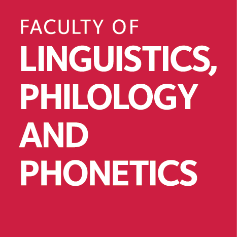
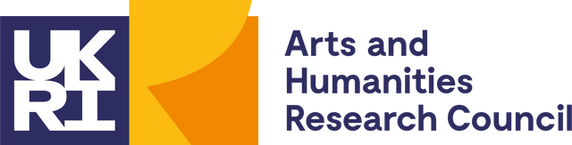

<!-- README.md is generated from README.Rmd. Please edit that file -->

# R codes and curated dataset for “EnoLEX: A Diachronic Lexical Database for the Enggano Language”

<!-- badges: start -->

 *This work is funded by the Arts and Humanities Research Council
(AHRC) Grant IDs
[AH/S011064/1](https://gtr.ukri.org/projects?ref=AH%2FS011064%2F1) and
[AH/W007290/1](https://gtr.ukri.org/projects?ref=AH%2FW007290%2F1), both
led by the Faculty of Linguistics, Philology and Phonetics at the
University of Oxford, UK. Visit the [central webpage of the Enggano
project](https://enggano.ling-phil.ox.ac.uk/)*.

<a property="dct:title" rel="cc:attributionURL" href="https://enggano.shinyapps.io/enolex/">EnoLEX
online database</a> edited by
<a rel="cc:attributionURL dct:creator" property="cc:attributionName" href="https://github.com/engganolang/enolex">Daniel
Krauße, Gede Primahadi W. Rajeg, Cokorda Pramartha, Erik Zobel, Bernd
Nothofer, Charlotte Hemmings, Sarah Ogilvie, I Wayan Arka, and Mary
Dalrymple</a> is licensed under
<a href="https://creativecommons.org/licenses/by-nc-sa/4.0/?ref=chooser-v1" target="_blank" rel="license noopener noreferrer" style="display:inline-block;">Creative
Commons Attribution-NonCommercial-ShareAlike 4.0
International</a>

<!-- badges: end -->

## Overview

EnoLEX collates lexical data from legacy materials and contemporary
fieldwork data about the Enggano language, ranging from simple/short and
extensive word lists, anthropological and ethnographic writings, a
dictionary, thesis, and contemporary Enggano data. The materials span
over 150 years from the middle of the 19th century up to the present.
With expert cognate-judgement, EnoLEX offers historical development of
word forms expressing a certain concept/meaning.

## How to cite

[EnoLEX](https://enggano.shinyapps.io/enolex/) is published as a
[Shiny](https://shiny.posit.co) web
[application](https://github.com/engganolang/enolex/tree/main/enolex)
programmed [in
R](https://github.com/engganolang/enolex/blob/main/enolex/app.R) by Gede
Primahadi Wijaya Rajeg. Please cite this repository of R source codes
and curated dataset for EnoLEX as follows:

> Rajeg, G. P. W., Krauße, D., Pramartha, C., Zobel, E., Nothofer, B.,
> Hemmings, C., Ogilvie, S., Arka, I. W., & Dalrymple, M. (2024). *R
> codes and curated dataset for* *“EnoLEX: A Diachronic Lexical Database
> for the Enggano Language”* (Version 0.0.2) \[Computer software\].
> Available at <https://github.com/engganolang/enolex>

Please cite, respectively, the EnoLEX online database and the
proceedings paper describing it as follows:

> Krauße, Daniel, Gede Primahadi Wijaya Rajeg, Cokorda Pramartha, Erik
> Zobel, Bernd Nothofer, Charlotte Hemmings, Sarah Ogilvie, I Wayan
> Arka, Mary Dalrymple (2024). *EnoLEX: A Diachronic Lexical Database
> for the Enggano Language*. Available online at
> <https://enggano.shinyapps.io/enolex/>

> Rajeg, Gede Primahadi Wijaya, Daniel Krauße, and Cokorda Rai Adi
> Pramartha (2024). [EnoLEX: A Diachronic Lexical Database for the
> Enggano language](https://doi.org/10.25446/oxford.27013864.v1). In
> *Proceedings of AsiaLex 2024 (The Asian Association for Lexicography
> 2024 Hybrid Conference)*. Toyo University, Tokyo: Japan.
> <https://doi.org/10.25446/oxford.27013864.v1>

The
[`acd.rds`](https://github.com/engganolang/enolex/blob/main/data/acd.rds)
data is derived from the Austronesian Comparative Dictionary (ACD)
dataset and needs to be cited independently as follows:

> Robert Blust, Stephen Trussel, & Alexander D. Smith. (2023). CLDF
> dataset derived from Blust’s “Austronesian Comparative Dictionary”
> (v1.2) \[Data set\]. Zenodo. <https://doi.org/10.5281/zenodo.7741197>

The ACD dataset is read via the .json metadata file using
`rcldf::cldf()` function in the [`rcldf` R package by Simon J.
Greenhill](https://github.com/SimonGreenhill/rcldf).
